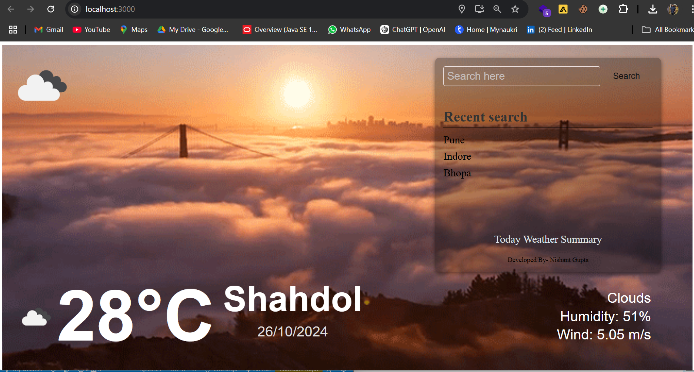
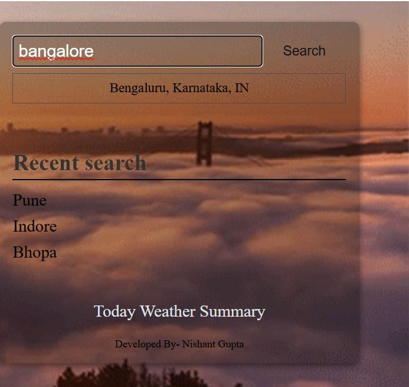
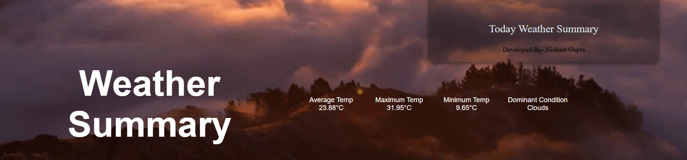
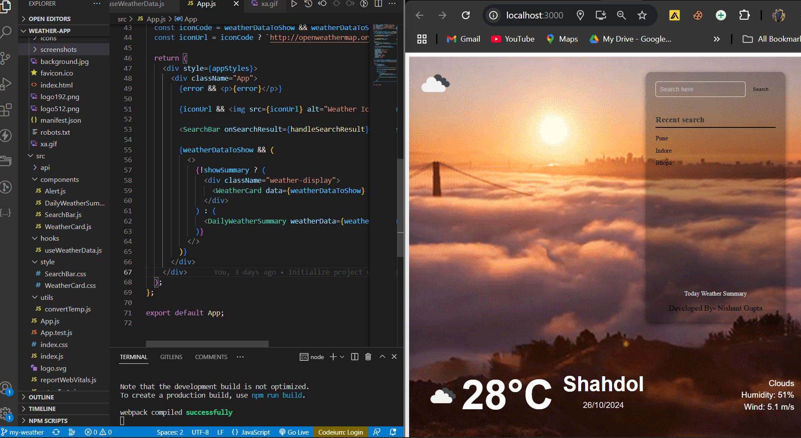

# Weather Monitoring Application 🌤️
This is a fully functional Weather Monitoring App that allows users to search for weather information of different cities and view their current weather, daily weather summary, and recent searches. The app dynamically adjusts based on real-time weather conditions, displaying customized weather icons and providing a responsive, user-friendly interface with an engaging GIF background.

# Table of Contents
Folder Structure
Tech Stack
Features
Application Flow
Screenshots
Installation
Usage
Responsive Design
Future Enhancements

# Folder Structure
/weather_app
├── /public
│   ├── index.html
│   ├── /icons                # Custom weather icons based on condition codes (e.g., 01d.png, 02n.png)
│   ├── /backgrounds          # Background images including the GIF used for weather visualization
│   ├── /screenshots          # Screenshots for documentation
│   └── /xa.gif               # GIF background to enhance UI
├── /src
│   ├── /api
│   │   └── weatherApi.js     # API calls to OpenWeather
│   ├── /components           # React components
│   │   ├── WeatherCard.js    # Displays current weather
│   │   ├── SearchBar.js      # Search bar for weather search by city
│   │   └── DailyWeatherSummary.js # Displays daily weather summary
│   ├── /hooks
│   │   └── useWeatherData.js # Custom hook to fetch weather data
│   ├── /style
│   │   ├── WeatherCard.css   # Weather card styling
│   │   ├── SearchBar.css     # Search bar styling
│   │   └── styles.css        # Global app styling
├── App.js                    # Main app component
├── index.js                  # Entry point for the React app
└── package.json              # Project dependencies and scripts

Tech Stack
React: JavaScript library for building user interfaces
OpenWeather API: Real-time weather data provider
CSS (Flexbox): For responsive styling and layout
JavaScript: Application logic
Axios: HTTP client for API requests
LocalStorage: Storing recent searches for quick access
GIF Background: Enhances the UI using dynamic animated backgrounds based on weather conditions

# Features
Current Weather: Displays temperature, weather conditions, humidity, and wind speed for the user's current location or any searched city.
Custom Weather Icons: Custom icons that reflect weather conditions, with a fallback to OpenWeather icons.
Recent Searches: Displays recent city searches in a scrollable list for quick access.
Daily Weather Summary: Shows the average, max, and min temperature for the day, along with the dominant weather condition.
Weather Alerts: Alerts for temperatures exceeding a specified threshold.
GIF Background: A dynamic and visually appealing animated background enhances the app's UI, adjusting based on weather conditions.
Responsive Design: App layout adjusts seamlessly across all devices using CSS Flexbox. The application is optimized for both short screens and large displays, ensuring a user-friendly experience regardless of device size.

# Application Flow
Weather Data Fetching: Weather data is fetched from the OpenWeather API for the current location or any city searched by the user.
City Search with Suggestions: The search bar provides real-time suggestions based on input.
Weather Card: Displays temperature, wind speed, and weather condition for the selected city.
Recent Searches: Keeps track of recent city searches and allows users to reselect them.
Daily Weather Summary: Shows the weather summary, including temperature details and conditions for the entire day.
Custom Icons: Custom icons for each weather condition are rendered. If the icon isn't available, it defaults to OpenWeather icons.
GIF Background: Provides a dynamic atmosphere to the app based on weather, enhancing the user experience.

# Screenshots:
 1. Main Weather Display

 2. City Search Functionality

 3. Daily Weather Summary

 5. Responsive Layout

# Installation
Clone the repository:
git clone https://github.com/Nishant-97Gupta/Weather_app.git
cd weather_app

# Install the dependencies:
npm install

# Run the app
npm start

# Open the app in your browser at http://localhost:3000.

# Usage
Search for Weather: Type a city name in the search bar and view the weather conditions.
Current Location: Allow location access to see weather data for your current position.
Recent Searches: Quickly view weather for previously searched cities.
Toggle Daily Summary: Switch to the daily summary for average, max, and min temperatures.

# Responsive Design
The app is fully responsive, adjusting its layout dynamically using CSS Flexbox to cater to different screen sizes, including short screens. The app ensures a seamless experience on mobile devices, tablets, and desktops:

Flexbox is utilized to handle layouts, ensuring components resize proportionally to the viewport.
Weather cards, search bars, and other UI components are flexed to adapt smoothly to different screen dimensions, making the app scalable across devices.

# Future Enhancements
Push notifications for weather alerts.
Enhanced daily weather history tracking.
Additional weather data providers for richer insights.

